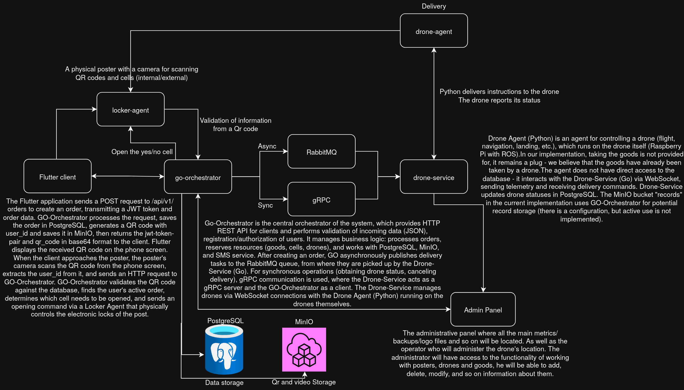

# System Architecture

## Overview

SkyPost Delivery is a distributed drone-based autonomous delivery system designed for delivering goods from merchants to end users via parcel lockers. The system employs microservices architecture with event-driven communication, real-time monitoring, and hardware integration.

## High-Level Architecture



```
┌─────────────────────────────────────────────────────────────────┐
│                         CLIENT LAYER                            │
├─────────────────────────────────────────────────────────────────┤
│                                                                 │
│  ┌──────────────┐    ┌──────────────┐    ┌──────────────┐       │
│  │  Mobile App  │    │ Admin Panel  │    │   Swagger    │       │
│  │  (Flutter)   │    │   (React)    │    │     UI       │       │
│  └──────┬───────┘    └───────┬──────┘    └────────┬─────┘       │
│         │                    │                    │             │
└─────────┼────────────────────┼────────────────────┼─────────────┘
          │                    │                    │
          │ REST API           │ REST/WS            │ Swagger
          │                    │                    │
┌─────────▼────────────────────▼────────────────────▼─────────────┐
│                       API GATEWAY LAYER                         │
├─────────────────────────────────────────────────────────────────┤
│                                                                 │
│  ┌───────────────────────────────────────────────────────────┐  │
│  │                  Nginx Reverse Proxy                      │  │
│  │  ┌─────────────┐  ┌─────────────┐  ┌─────────────────┐    │  │
│  │  │ /api/v1/*   │  │   /ws/*     │  │  /admin/*       │    │  │
│  │  │ → :8080     │  │   → :8081   │  │  → static files │    │  │
│  │  └─────────────┘  └─────────────┘  └─────────────────┘    │  │
│  └───────────────────────────────────────────────────────────┘  │
│                                                                 │
└─────────────────────────────────────────────────────────────────┘
          │                          │
          │ HTTP                     │ WebSocket
          │                          │
┌─────────▼──────────────────┐  ┌────▼─────────────────────────────┐
│  BACKEND SERVICE LAYER     │  │  REAL-TIME COMMUNICATION LAYER   │
├────────────────────────────┤  ├──────────────────────────────────┤
│                            │  │                                  │
│  ┌───────────────────────┐ │  │  ┌────────────────────────────┐  │
│  │   Go-Orchestrator     │ │  │  │     Drone Service          │  │
│  │  ┌────────────────┐   │ │  │  │  ┌──────────────────────┐  │  │
│  │  │ REST API (Gin) │   │ │  │  │  │  WebSocket Hub       │  │  │
│  │  ├────────────────┤   │ │  │  │  │  ┌─────┐  ┌─────┐    │  │  │ 
│  │  │ gRPC Server    │ ◄─┼─┼──┼──┼──┼──┤Drone│  │Admin│    │  │  │
│  │  ├────────────────┤   │ │  │  │  │  └─────┘  └─────┘    │  │  │
│  │  │ Order Worker   │   │ │  │  │  ├──────────────────────┤  │  │
│  │  │ (Background)   │   │ │  │  │  │ RabbitMQ Consumer    │  │  │
│  │  ├────────────────┤   │ │  │  │  │ (Delivery Tasks)     │  │  │
│  │  │ RabbitMQ Pub   │ ──┼─┼──┼─►│  ├──────────────────────┤  │  │
│  │  └────────────────┘   │ │  │  │  │ gRPC Client          │  │  │
│  └───────────────────────┘ │  │  │  │ (to Orchestrator)    │  │  │   
│                            │  │  │  └──────────────────────┘  │  │
└────────────────────────────┘  │  └────────────────────────────┘  │
          │                     │                                  │
          │                     └──────────────────────────────────┘
          │                                      │
          │ RabbitMQ                             │ WebSocket
          │                                      │
┌─────────▼──────────────────────────────────────▼─────────────────┐
│                    MESSAGE & EVENT LAYER                         │
├──────────────────────────────────────────────────────────────────┤
│                                                                  │
│  ┌────────────────────────────────────────────────────────────┐  │
│  │                     RabbitMQ 4.2.0                         │  │
│  │  ┌──────────────────┐  ┌──────────────────────────────┐    │  │
│  │  │ deliveries queue │  │ deliveries.priority queue    │    │  │
│  │  └──────────────────┘  └──────────────────────────────┘    │  │
│  │        Routing Key: delivery_tasks                         │  │
│  └────────────────────────────────────────────────────────────┘  │
│                                                                  │
└──────────────────────────────────────────────────────────────────┘
                                   │
                                   │ Consume Tasks
                                   │
┌──────────────────────────────────▼───────────────────────────────┐
│                     HARDWARE AGENT LAYER                         │
├──────────────────────────────────────────────────────────────────┤
│                                                                  │
│  ┌──────────────────────────┐      ┌──────────────────────────┐  │
│  │  Drone Agent (Python)    │      │  Locker Agent (Go)       │  │
│  │  ┌────────────────────┐  │      │  ┌────────────────────┐  │  │
│  │  │ WebSocket Client   │  │      │  │  HTTP Server       │  │  │
│  │  ├────────────────────┤  │      │  ├────────────────────┤  │  │
│  │  │ ROS Bridge         │  │      │  │  HTTP Client (API) │  │  │
│  │  ├────────────────────┤  │      │  ├────────────────────┤  │  │
│  │  │ State Machine      │  │      │  │  Serial Controller │  │  │
│  │  ├────────────────────┤  │      │  ├────────────────────┤  │  │
│  │  │ Flight Controller  │  │      │  │  Cell Manager      │  │  │
│  │  └────────────────────┘  │      │  └────────────────────┘  │  │
│  └───────────┬──────────────┘      └────────────┬─────────────┘  │
│              │                                  │                │
└──────────────┼──────────────────────────────────┼────────────────┘
               │                                  │
┌──────────────▼──────────────┐      ┌────────────▼────────────────┐
│  HARDWARE LAYER (Drone)     │      │  HARDWARE LAYER (Locker)    │
├─────────────────────────────┤      ├─────────────────────────────┤
│                             │      │                             │
│  ┌───────────────────────┐  │      │   ┌─────────────────────┐   │
│  │  ROS Noetic           │  │      │   │  Orange Pi SBC      │   │
│  │  ┌─────────────────┐  │  │      │   │  ┌───────────────┐  │   │
│  │  │ Clover Flight   │  │  │      │   │  │Arduino(Serial)│  │   │
│  │  │     Stack       │  │  │      │   │  ├───────────────┤  │   │
│  │  ├─────────────────┤  │  │      │   │  │Cell Lock Motor│  │   │
│  │  │ MAVROS          │  │  │      │   │  ├───────────────┤  │   │
│  │  ├─────────────────┤  │  │      │   │  │ QR Camera     │  │   │
│  │  │ Camera Topics   │  │  │      │   │  ├───────────────┤  │   │
│  │  └─────────────────┘  │  │      │   │  │Display Screen │  │   │
│  │                       │  │      │   │  └───────────────┘  │   │
│  ├───────────────────────┤  │      │   └─────────────────────┘   │
│  │ Pixhawk Flight        │  │      │                             │
│  │     Computer          │  │      └─────────────────────────────┘
│  ├───────────────────────┤  │
│  │ Camera (OpenCV)       │  │
│  ├───────────────────────┤  │
│  │ Servo (Cargo Release) │  │
│  └───────────────────────┘  │
│                             │
└─────────────────────────────┘

┌───────────────────────────────────────────────────────────────────┐
│                      DATA PERSISTENCE LAYER                       │
├───────────────────────────────────────────────────────────────────┤
│                                                                   │
│  ┌──────────────┐  ┌──────────────┐  ┌────────────────────────┐   │
│  │ PostgreSQL   │  │   MinIO      │  │       Redis            │   │
│  │   (DB)       │  │  (Object     │  │      (Cache)           │   │
│  │              │  │  Storage)    │  │                        │   │
│  └──────────────┘  └──────────────┘  └────────────────────────┘   │
│                                                                   │
└───────────────────────────────────────────────────────────────────┘

┌───────────────────────────────────────────────────────────────────┐
│                 OBSERVABILITY & MONITORING LAYER                  │
├───────────────────────────────────────────────────────────────────┤
│                                                                   │
│  ┌────────────┐  ┌────────────┐  ┌──────────┐  ┌─────────────┐    │
│  │Prometheus  │  │  Grafana   │  │   Loki   │  │  Promtail   │    │
│  │ (Metrics)  │  │(Dashboard) │  │  (Logs)  │  │  (Collect)  │    │
│  └────────────┘  └────────────┘  └──────────┘  └─────────────┘    │
│                                                                   │
│  ┌────────────┐  ┌────────────┐  ┌───────────────────────────┐    │
│  │  cAdvisor  │  │   Node     │  │  Postgres Exporter        │    │
│  │ (Container)│  │  Exporter  │  │   (DB Metrics)            │    │
│  └────────────┘  └────────────┘  └───────────────────────────┘    │
│                                                                   │
└───────────────────────────────────────────────────────────────────┘
```

## Component Architecture

### 1. Go-Orchestrator Service

**Architecture Pattern**: Clean Architecture + Layered Architecture

```
┌─────────────────────────────────────────────────────────────┐
│                      HTTP Layer (Gin)                       │
│  ┌────────────┐  ┌────────────┐  ┌────────────────────────┐ │
│  │  Router    │  │ Middleware │  │     Controllers        │ │
│  │            │  │ - JWT Auth │  │ - UserController       │ │
│  │ /api/v1/*  │  │ - CORS     │  │ - OrderController      │ │
│  │            │  │ - Logging  │  │ - DroneController      │ │
│  │            │  │ - Rate Lim │  │ - DeliveryController   │ │
│  └────────────┘  └────────────┘  └────────────────────────┘ │
└───────────────────────────┬─────────────────────────────────┘
                            │
┌───────────────────────────▼─────────────────────────────────┐
│                    gRPC Server Layer                        │
│  ┌──────────────────────────────────────────────────────┐   │
│  │          OrchestratorService                         │   │
│  │  - RequestCellOpen(CellOpenRequest) → Response       │   │
│  └──────────────────────────────────────────────────────┘   │
└───────────────────────────┬─────────────────────────────────┘
                            │
┌───────────────────────────▼─────────────────────────────────┐
│                      Use Case Layer                         │
│  ┌──────────────┐  ┌──────────────┐  ┌──────────────────┐   │
│  │ UserUseCase  │  │OrderUseCase  │  │ DroneUseCase     │   │
│  ├──────────────┤  ├──────────────┤  ├──────────────────┤   │
│  │ OrderWorker  │  │LockerUseCase │  │DeliveryUseCase   │   │
│  │ (Background) │  │              │  │                  │   │
│  └──────────────┘  └──────────────┘  └──────────────────┘   │
└───────────────────────────┬─────────────────────────────────┘
                            │
┌───────────────────────────▼─────────────────────────────────┐
│                     Repository Layer                        │
│  ┌──────────────┐  ┌──────────────┐  ┌──────────────────┐   │
│  │  PostgreSQL  │  │   WebAPI     │  │   External APIs  │   │
│  │  Repos       │  │   Adapters   │  │                  │   │
│  │              │  │              │  │  - SMS Service   │   │
│  │ - UserRepo   │  │ - LockerAPI  │  │  - MinIO (QR)    │   │
│  │ - OrderRepo  │  │ - QRGenAPI   │  │  - RabbitMQ      │   │
│  │ - DroneRepo  │  │              │  │                  │   │
│  └──────────────┘  └──────────────┘  └──────────────────┘   │
└─────────────────────────────────────────────────────────────┘
```

**Key Components**:

1. **HTTP Controllers**: Handle incoming REST API requests
2. **gRPC Server**: Receives cell opening requests from drone-service
3. **Order Worker**: Background goroutine that polls pending orders every 5 seconds
4. **Use Cases**: Business logic implementation
5. **Repositories**: Data access and external service integration
6. **Middlewares**: Cross-cutting concerns (auth, logging, CORS)

**Communication Patterns**:
- **REST API**: Gin framework with Swagger documentation
- **gRPC**: Protocol Buffers for inter-service communication
- **RabbitMQ Publishing**: Asynchronous task delivery
- **PostgreSQL**: SQLC for type-safe queries
- **MinIO**: S3-compatible object storage
- **SMS Service**: HTTP API integration

### 2. Drone Service

**Architecture Pattern**: Event-Driven Architecture + WebSocket Hub Pattern

```
┌─────────────────────────────────────────────────────────────┐
│                   WebSocket Hub Layer                       │
│  ┌────────────────┐  ┌────────────────┐  ┌───────────────┐  │
│  │  Drone Hub     │  │   Admin Hub    │  │   Video Hub   │  │
│  │                │  │                │  │               │  │
│  │ - Registration │  │ - Monitoring   │  │ - Frame Relay │  │
│  │ - Telemetry    │  │ - Commands     │  │               │  │
│  │ - Commands     │  │ - Status       │  │               │  │
│  └────────────────┘  └────────────────┘  └───────────────┘  │
└───────────────────────────┬─────────────────────────────────┘
                            │
┌───────────────────────────▼─────────────────────────────────┐
│                      Use Case Layer                         │
│  ┌──────────────────────┐  ┌──────────────────────────────┐ │
│  │ DroneManagerUseCase  │  │  DeliveryUseCase             │ │
│  │                      │  │                              │ │
│  │ - RegisterDrone      │  │ - AssignDelivery             │ │
│  │ - UpdateTelemetry    │  │ - SendCommand                │ │
│  │ - DisconnectDrone    │  │ - UpdateStatus               │ │
│  └──────────────────────┘  └──────────────────────────────┘ │
└───────────────────────────┬─────────────────────────────────┘
                            │
┌───────────────────────────▼─────────────────────────────────┐
│                     Integration Layer                       │
│  ┌──────────────┐  ┌──────────────┐  ┌──────────────────┐   │
│  │  PostgreSQL  │  │   RabbitMQ   │  │   gRPC Client    │   │
│  │   Repos      │  │   Consumer   │  │                  │   │
│  │              │  │              │  │  (Orchestrator)  │   │
│  │ - DroneRepo  │  │ - Deliveries │  │                  │   │
│  │ - DelivRepo  │  │   Queue      │  │ - CellOpenRPC    │   │
│  └──────────────┘  └──────────────┘  └──────────────────┘   │
└─────────────────────────────────────────────────────────────┘
```

**Key Components**:

1. **WebSocket Hubs**: Manage persistent connections
   - Drone Hub: Drone registration, telemetry, commands
   - Admin Hub: Real-time monitoring for admin panel
   - Video Hub: Video frame relay from drones to admins

2. **RabbitMQ Consumer**: Listens for delivery tasks
   - Queue: `deliveries` (normal priority)
   - Queue: `deliveries.priority` (high priority)

3. **Use Cases**:
   - DroneManagerUseCase: Connection lifecycle management
   - DeliveryUseCase: Delivery orchestration

4. **gRPC Client**: Communicates with orchestrator for cell operations

**Data Flow**:
1. RabbitMQ delivers task → Consumer
2. Consumer calls DeliveryUseCase
3. Use case finds available drone via DroneManager
4. Sends delivery task via WebSocket to drone
5. Drone reports progress via WebSocket
6. Service calls orchestrator gRPC for cell opening
7. Updates delivery status in PostgreSQL

### 3. Drone Agent

**Architecture Pattern**: Finite State Machine + Hexagonal Architecture

```
┌─────────────────────────────────────────────────────────────┐
│                      Application Layer                      │
│  ┌──────────────────────────────────────────────────────┐   │
│  │                   main.py (Entry Point)              │   │
│  │  - Load Configuration                                │   │
│  │  - Initialize Services                               │   │
│  │  - Start Event Loop                                  │   │
│  └──────────────────────────────────────────────────────┘   │
└───────────────────────────┬─────────────────────────────────┘
                            │
┌───────────────────────────▼─────────────────────────────────┐
│                       Service Layer                         │
│  ┌──────────────────┐  ┌──────────────────────────────────┐ │
│  │ DeliveryService  │  │   TelemetryService               │ │
│  │                  │  │                                  │ │
│  │ - OnTaskReceived │  │   - SendHeartbeat (3s interval)  │ │
│  │ - OnEventReceived│  │   - CollectTelemetry             │ │
│  └──────────────────┘  └──────────────────────────────────┘ │
│                                                             │
│  ┌──────────────────────────────────────────────────────┐   │
│  │              VideoService                            │   │
│  │  - StreamVideo (ROS camera frames)                   │   │
│  └──────────────────────────────────────────────────────┘   │
└───────────────────────────┬─────────────────────────────────┘
                            │
┌───────────────────────────▼─────────────────────────────────┐
│                        Core Layer                           │
│  ┌────────────────┐  ┌────────────────┐  ┌──────────────┐   │
│  │ StateMachine   │  │ WebSocketClient│  │  ROSBridge   │   │
│  │                │  │                │  │              │   │ 
│  │ IDLE           │  │ - Connect()    │  │ - Subscribe  │   │
│  │ NAVIGATING     │  │ - Send()       │  │   Topics     │   │
│  │ WAITING_DROP   │  │ - Receive()    │  │ - Publish    │   │
│  │ DROPPED        │  │ - Reconnect    │  │              │   │
│  │ RETURNING      │  │                │  │              │   │
│  │ COMPLETED      │  │                │  │              │   │
│  └────────────────┘  └────────────────┘  └──────────────┘   │
└───────────────────────────┬─────────────────────────────────┘
                            │
┌───────────────────────────▼─────────────────────────────────┐
│                      Hardware Layer                         │
│  ┌──────────────────┐  ┌────────────────────────────────┐   │
│  │FlightController  │  │      CameraHandler             │   │
│  │                  │  │                                │   │
│  │ - StartFlight()  │  │  - ROS Image Subscriber        │   │
│  │ - StopFlight()   │  │  - JPEG Encoding               │   │
│  │ - Subprocess Mgmt│  │  - Frame Buffering             │   │
│  └──────────────────┘  └────────────────────────────────┘   │
└───────────────────────────┬─────────────────────────────────┘
                            │
┌───────────────────────────▼─────────────────────────────────┐
│                       ROS Layer (External)                  │
│  ┌──────────────────────────────────────────────────────┐   │
│  │                  ROS Noetic                          │   │
│  │  ┌────────────────────────────────────────────────┐  │   │
│  │  │  Topics:                                       │  │   │
│  │  │  - /main_camera/image_raw (sensor_msgs/Image)  │  │   │
│  │  │  - /mavros/battery (sensor_msgs/BatteryState)  │  │   │
│  │  │  - /mavros/local_position/pose (PoseStamped)   │  │   │
│  │  └────────────────────────────────────────────────┘  │   │
│  │                                                      │   │
│  │  ┌────────────────────────────────────────────────┐  │   │
│  │  │  Clover Services:                              │  │   │
│  │  │  - /navigate (navigate to point)               │  │   │
│  │  │  - /land (landing)                             │  │   │
│  │  │  - /get_telemetry (get current state)          │  │   │
│  │  └────────────────────────────────────────────────┘  │   │
│  └──────────────────────────────────────────────────────┘   │
└─────────────────────────────────────────────────────────────┘
```

**State Machine Transitions**:

```
     ┌──────────┐
     │   IDLE   │
     └────┬─────┘
          │ task_assigned
          ▼
   ┌─────────────┐
   │ NAVIGATING  │◄─────┐
   └──────┬──────┘      │
          │ arrived     │ retry_navigation
          ▼             │
  ┌───────────────┐     │
  │ WAITING_DROP  │─────┘
  └───────┬───────┘
          │ drop_confirmed
          ▼
    ┌─────────┐
    │ DROPPED │
    └────┬────┘
         │ return_command
         ▼
   ┌──────────┐
   │RETURNING │
   └────┬─────┘
        │ arrived_base
        ▼
  ┌───────────┐
  │ COMPLETED │
  └───────────┘
```

**Communication Protocol** (WebSocket JSON):

**Drone → Service Messages**:
```json
{
  "type": "register",
  "payload": {
    "drone_id": "uuid",
    "model": "Clover 4",
    "battery_level": 95.5
  }
}

{
  "type": "telemetry",
  "payload": {
    "battery_level": 85.3,
    "position": {"lat": 55.7558, "lon": 37.6173, "alt": 10.5},
    "status": "flying"
  }
}

{
  "type": "event",
  "payload": {
    "event_type": "arrived",
    "delivery_id": "uuid",
    "timestamp": "2024-01-15T12:00:00Z"
  }
}
```

**Service → Drone Messages**:
```json
{
  "type": "task",
  "payload": {
    "delivery_id": "uuid",
    "destination": {"lat": 55.7558, "lon": 37.6173, "aruco_id": 123},
    "priority": "normal"
  }
}

{
  "type": "command",
  "payload": {
    "command": "drop_cargo",
    "delivery_id": "uuid"
  }
}
```

### 4. Locker Agent

**Architecture Pattern**: Repository Pattern + Hardware Abstraction

```
┌─────────────────────────────────────────────────────────────┐
│                      HTTP Server Layer                      │
│  ┌──────────────────────────────────────────────────────┐   │
│  │                   Gin Router                         │   │
│  │  - POST /api/cells/sync                              │   │
│  │  - POST /api/cells/open                              │   │
│  │  - POST /api/cells/close                             │   │
│  │  - POST /api/qr/scan                                 │   │
│  │  - GET  /health                                      │   │
│  └──────────────────────────────────────────────────────┘   │
└───────────────────────────┬─────────────────────────────────┘
                            │
┌───────────────────────────▼─────────────────────────────────┐
│                      Use Case Layer                         │
│  ┌──────────────────────┐  ┌──────────────────────────────┐ │
│  │  CellManagerUseCase  │  │   QRScannerUseCase           │ │
│  │                      │  │                              │ │
│  │ - SyncCells()        │  │ - ScanQR()                   │ │
│  │ - OpenCell()         │  │ - ValidateWithOrchestrator() │ │
│  │ - CloseCell()        │  │                              │ │
│  └──────────────────────┘  └──────────────────────────────┘ │
└───────────────────────────┬─────────────────────────────────┘
                            │
┌───────────────────────────▼─────────────────────────────────┐
│                     Repository Layer                        │
│  ┌──────────────────────┐  ┌──────────────────────────────┐ │
│  │  InMemoryCellRepo    │  │   OrchestratorAPIClient      │ │
│  │                      │  │                              │ │
│  │ - UUID ↔ Cell ID Map │  │ - ValidateQR()               │ │
│  │ - Cell Status Cache  │  │ - ConfirmPickup()            │ │
│  └──────────────────────┘  └──────────────────────────────┘ │
└───────────────────────────┬─────────────────────────────────┘
                            │
┌───────────────────────────▼─────────────────────────────────┐
│                      Hardware Layer                         │
│  ┌──────────────┐  ┌──────────────┐  ┌──────────────────┐   │
│  │  Arduino     │  │  QRCamera    │  │    Display       │   │
│  │  Controller  │  │              │  │                  │   │ 
│  │              │  │ - OpenCV     │  │ - Show Messages  │   │
│  │ - Serial     │  │ - Detect QR  │  │ - Show Status    │   │
│  │   /dev/tty   │  │              │  │                  │   │
│  │ - Commands   │  │              │  │                  │   │
│  │   OPEN_1     │  │              │  │                  │   │
│  │   CLOSE_1    │  │              │  │                  │   │
│  └──────────────┘  └──────────────┘  └──────────────────┘   │
└─────────────────────────────────────────────────────────────┘
```

**Serial Protocol** (Arduino Communication):
```
OPEN_<cell_number>   → Opens cell lock
CLOSE_<cell_number>  → Closes cell lock
STATUS               → Returns cell states
```

## Communication Protocols

### 1. REST API

**Endpoint Pattern**: `/api/v1/<resource>`

**Authentication**: JWT Bearer Token
```http
Authorization: Bearer <jwt_token>
```

**Standard Response Format**:
```json
{
  "success": true,
  "data": { ... },
  "error": null
}
```

**Error Response**:
```json
{
  "success": false,
  "data": null,
  "error": {
    "code": "ORDER_NOT_FOUND",
    "message": "Order with ID ... not found"
  }
}
```

### 2. gRPC

**Protocol Buffer Definition**:
```protobuf
service OrchestratorService {
  rpc RequestCellOpen(CellOpenRequest) returns (CellOpenResponse);
}

message CellOpenRequest {
  string delivery_id = 1;
  string parcel_automat_id = 2;
  CellType cell_type = 3;
}

message CellOpenResponse {
  bool success = 1;
  string cell_id = 2;
  string error_message = 3;
}
```

**Usage**:
- Drone-service → Orchestrator: Request cell opening
- Retry policy: 3 attempts with exponential backoff
- Timeout: 5 seconds per request

### 3. WebSocket

**Connection Upgrade**:
```http
GET /ws/drone HTTP/1.1
Host: drone-service:8081
Upgrade: websocket
Connection: Upgrade
Sec-WebSocket-Key: <key>
```

**Message Format**: JSON
```json
{
  "type": "string",
  "payload": { ... },
  "timestamp": "ISO8601"
}
```

**Message Types**:
- `register`: Drone registration
- `telemetry`: Periodic status updates
- `event`: State change notifications
- `task`: Delivery task assignment
- `command`: Control commands
- `video_frame`: Base64-encoded JPEG frames

**Heartbeat**: Ping/Pong every 30 seconds

### 4. RabbitMQ

**Exchange Configuration**:
- Type: Direct
- Name: `delivery_exchange`
- Durable: true

**Queues**:
- `deliveries`: Normal priority (prefetch=1)
- `deliveries.priority`: High priority (prefetch=1)

**Message Format**:
```json
{
  "delivery_id": "uuid",
  "order_id": "uuid",
  "drone_id": "uuid",
  "destination": {
    "parcel_automat_id": "uuid",
    "latitude": 55.7558,
    "longitude": 37.6173,
    "aruco_id": 123
  },
  "priority": "normal|priority",
  "created_at": "2024-01-15T12:00:00Z"
}
```

**Acknowledgment**: Manual ACK after task assignment

### 5. HTTP (Locker Agent)

**Orchestrator → Locker Agent**:
```http
POST /api/cells/open HTTP/1.1
Content-Type: application/json

{
  "cell_uuid": "uuid",
  "delivery_id": "uuid"
}
```

**Response**:
```json
{
  "success": true,
  "cell_id": 5,
  "opened_at": "2024-01-15T12:00:00Z"
}
```

## Data Flow Scenarios

### Scenario 1: Order Creation and Delivery

```
1. User creates order via Mobile App
   ├─► POST /api/v1/orders
   ├─► Orchestrator validates goods availability
   ├─► Orchestrator creates order in PostgreSQL (status: pending)
   ├─► Generates QR code, uploads to MinIO
   └─► Returns order_id and qr_code_url to user

2. Order Worker (Background) processes pending orders
   ├─► SELECT * FROM orders WHERE status = 'pending' (every 5s)
   ├─► Finds available drone in parcel automat location
   ├─► Creates delivery record (status: assigned)
   ├─► Publishes delivery task to RabbitMQ
   └─► Updates order status to 'processing'

3. Drone Service consumes delivery task
   ├─► RabbitMQ consumer receives message
   ├─► Calls DeliveryUseCase.AssignDelivery()
   ├─► Finds connected drone via DroneManager
   ├─► Sends task via WebSocket to drone agent
   └─► ACKs RabbitMQ message

4. Drone Agent executes delivery
   ├─► Receives task via WebSocket
   ├─► State: IDLE → NAVIGATING
   ├─► Starts delivery_flight.py subprocess
   ├─► Clover navigates to ArUco marker
   ├─► Sends event: "arrived" via WebSocket
   ├─► State: NAVIGATING → WAITING_DROP

5. Drone Service requests cell opening
   ├─► Receives "arrived" event from drone
   ├─► Calls Orchestrator gRPC: RequestCellOpen()
   └─► Orchestrator HTTP request to Locker Agent

6. Locker Agent opens cell
   ├─► Receives POST /api/cells/open
   ├─► Sends serial command to Arduino: OPEN_5
   ├─► Returns success to Orchestrator
   └─► Orchestrator returns cell_id to Drone Service

7. Drone drops cargo
   ├─► Drone Service sends command: "drop_cargo"
   ├─► Drone Agent receives command
   ├─► Activates servo via pigpio
   ├─► Sends event: "drop_confirmed"
   ├─► State: WAITING_DROP → DROPPED

8. Drone returns to base
   ├─► Drone Service sends command: "return_to_base"
   ├─► Drone Agent receives command
   ├─► Starts flight_back.py subprocess
   ├─► State: DROPPED → RETURNING
   ├─► Sends event: "arrived_base"
   ├─► State: RETURNING → COMPLETED

9. User picks up cargo
   ├─► User scans QR code at parcel automat
   ├─► Locker Agent: POST /api/qr/scan
   ├─► Validates QR with Orchestrator
   ├─► Orchestrator validates QR, returns cell_uuid
   ├─► Locker Agent opens cell via Arduino
   ├─► User retrieves cargo
   ├─► Orchestrator updates order status: 'completed'
```

### Scenario 2: Drone Registration and Telemetry

```
1. Drone Agent starts
   ├─► Loads configuration from .env
   ├─► Initializes ROS bridge
   ├─► Connects to WebSocket: ws://drone-service:8081/ws/drone
   └─► Sends registration message

2. Drone Service registers drone
   ├─► WebSocket handler receives registration
   ├─► Calls DroneManagerUseCase.RegisterDrone()
   ├─► Stores connection in memory map
   ├─► Broadcasts to admin panel: new drone online
   └─► Returns confirmation to drone

3. Telemetry reporting (every 3 seconds)
   ├─► Drone Agent collects telemetry
   │   ├─► Battery from /mavros/battery topic
   │   ├─► Position from /mavros/local_position/pose
   │   └─► Current state from state machine
   ├─► Sends telemetry message via WebSocket
   ├─► Drone Service updates drone status
   └─► Broadcasts to admin panel for real-time monitoring

4. Video streaming
   ├─► Drone Agent subscribes to /main_camera/image_raw
   ├─► Converts ROS Image to JPEG (OpenCV)
   ├─► Sends video_frame message via WebSocket
   ├─► Drone Service relays to admin panel
   └─► Admin panel displays live video feed
```

### Scenario 3: Monitoring and Alerting

```
1. Metrics collection
   ├─► Prometheus scrapes metrics every 15s
   │   ├─► go-orchestrator:9091/metrics
   │   ├─► drone-service:9092/metrics
   │   ├─► rabbitmq:15692/metrics
   │   ├─► postgres-exporter:9187/metrics
   │   ├─► node-exporter:9100/metrics
   │   └─► cadvisor:8080/metrics
   └─► Stores time series data

2. Log aggregation
   ├─► Promtail scrapes logs from Docker containers
   ├─► Sends logs to Loki via HTTP
   ├─► Loki indexes and stores logs
   └─► Grafana queries Loki for log exploration

3. Alert evaluation
   ├─► Prometheus evaluates alert rules every 1m
   ├─► ServiceDown: service unavailable > 1m
   ├─► HighErrorRate: 5xx errors > 10% for 5m
   ├─► RabbitMQQueueTooLong: queue > 100 messages
   └─► PostgreSQLDown: database unavailable > 1m

4. Alert notification
   ├─► Prometheus Alertmanager receives alerts
   ├─► Routes to notification channels
   │   ├─► Email
   │   ├─► Telegram
   │   └─► PagerDuty (for critical alerts)
   └─► Grafana annotations show alerts on dashboards
```

## Security Architecture

### Authentication and Authorization

**JWT Token Structure**:
```json
{
  "sub": "user_uuid",
  "email": "user@example.com",
  "role": "user|admin",
  "exp": 1705320000,
  "iat": 1705233600
}
```

**Token Flow**:
1. User logs in: POST /api/v1/users/login
2. Orchestrator validates credentials
3. Generates JWT with HS256 algorithm
4. Returns access_token (expires in 24h)
5. Client includes token in Authorization header
6. Middleware validates token on each request

**Role-Based Access Control**:
- `user`: Can create orders, view own orders, generate QR codes
- `admin`: Full access to drones, goods, parcel automats, all orders

### API Security

**Rate Limiting**: 100 requests per minute per IP
**CORS**: Configured for web origins
**Input Validation**: Request body validation with struct tags
**SQL Injection Prevention**: Prepared statements via SQLC
**Password Hashing**: bcrypt with cost factor 10

### Network Security

**Docker Network Isolation**:
- `backend_network`: Services communicate internally
- `monitoring_network`: Monitoring stack isolated
- Only Nginx exposed on host ports

**TLS/SSL**:
- Nginx terminates TLS
- Internal service communication over HTTP (private network)
- gRPC with TLS for production

## Scalability Considerations

### Horizontal Scaling

**Stateless Services** (can scale horizontally):
- go-orchestrator: Load balanced with Nginx
- drone-service: Multiple instances with shared PostgreSQL

**Stateful Components**:
- PostgreSQL: Single master with read replicas
- RabbitMQ: Cluster mode with mirrored queues
- Redis: Cluster mode for session management

### Load Balancing

**Nginx Configuration**:
```nginx
upstream orchestrator {
    least_conn;
    server orchestrator1:8080;
    server orchestrator2:8080;
}

upstream drone_service {
    ip_hash;  # Sticky sessions for WebSocket
    server drone-service1:8081;
    server drone-service2:8081;
}
```

### Database Optimization

**Indexing Strategy**:
- `orders(user_id, status)`: Fast order lookups
- `deliveries(drone_id, status)`: Drone task queries
- `users(email)`, `users(phone_number)`: Authentication
- `locker_cells_out(parcel_automat_id, status)`: Cell availability

**Connection Pooling**:
- Max open connections: 25
- Max idle connections: 10
- Connection max lifetime: 5 minutes

## Fault Tolerance

### Retry Mechanisms

**WebSocket Reconnection**:
- Exponential backoff: 1s, 2s, 4s, 8s, 16s (max)
- Infinite retry attempts
- Message queue for offline buffering

**gRPC Retries**:
- Max attempts: 3
- Backoff: 100ms, 200ms, 400ms
- Timeout per attempt: 5s

**RabbitMQ**:
- Manual ACK after processing
- Dead letter queue for failed messages
- Message TTL: 24 hours

### Circuit Breaker

**External Service Calls**:
- SMS Service: Circuit opens after 5 failures
- Locker Agent API: Circuit opens after 3 failures
- Half-open state: Test request after 30s

### Health Checks

**Service Endpoints**:
- GET /health: Returns service status
- Checks: Database connectivity, RabbitMQ connection, disk space

**Docker Health Checks**:
```yaml
healthcheck:
  test: ["CMD", "curl", "-f", "http://localhost:8080/health"]
  interval: 30s
  timeout: 10s
  retries: 3
  start_period: 40s
```

## Performance Optimization

**Database Query Optimization**:
- SQLC for compile-time SQL validation
- Prepared statements reuse
- Batch inserts for telemetry data

**Caching Strategy**:
- Redis: User sessions (TTL: 24h)
- In-memory: Drone connection map
- Parcel automat cell mapping

**Async Processing**:
- RabbitMQ for long-running tasks
- Background workers for order processing
- WebSocket for non-blocking communication

**Resource Management**:
- Go goroutines with worker pools
- Python asyncio for concurrent operations
- Connection pooling for databases

## Deployment Architecture

**Container Orchestration**: Docker Compose (production-ready with Docker Swarm)

**Service Dependencies**:
```
postgres → orchestrator → nginx
       ↓ → drone-service → nginx
rabbitmq → drone-service
minio → orchestrator
redis → orchestrator
```

**Persistent Volumes**:
- `/var/lib/postgresql/data`: Database
- `/data/minio`: Object storage
- `/var/log`: Application logs

**Environment Configuration**:
- `.env` files for sensitive data
- `config.yaml` for service configuration
- Environment-specific compose files

## Conclusion

This architecture provides:
- **Modularity**: Independent microservices
- **Scalability**: Horizontal scaling support
- **Reliability**: Fault tolerance and retries
- **Observability**: Comprehensive monitoring
- **Security**: Authentication and authorization
- **Performance**: Async processing and caching
- **Maintainability**: Clean architecture patterns
