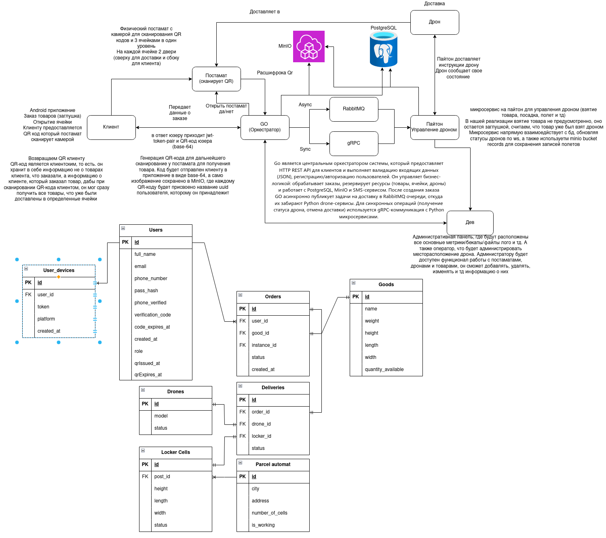

# Architecture Overview



This document outlines the system architecture of the hiTech drone delivery platform, covering service responsibilities, communication flows, data storage, and deployment topology.

## 1. High-Level Domains

- **Go Orchestrator (Backend API):** Central business logic—user management, orders, deliveries, parcel automats, goods catalog, and integration with external services (SMS provider, push notifications).
- **Drone Service (Python):** Bridge between orchestrator and physical drones. Manages WebSocket connections, delivery task execution, telemetry, and state synchronization.
- **Hardware Parsers:**
  - `parsers/drone` — ROS/Clover scripts running on the drone, handling takeoff, navigation, landing, and payload drop.
  - `parsers/parcel_automat` — Controller for locker hardware (Arduino firmware + Python application) interacting with the orchestrator via HTTP/gRPC.
- **Admin Panel:** React-based UI for operations staff to monitor drones, deliveries, automats, and system health.
- **Mobile App:** Flutter client for customers/couriers to place orders, track deliveries, and confirm pickup.

## 2. Core Services & Responsibilities

### Go Orchestrator
- REST API via Gin (`/api/v1`).
- gRPC server for parcel automat/drone interactions (`/pb`).
- Publishes delivery tasks to RabbitMQ (`deliveries`, `deliveries.priority`, `delivery.return`).
- Manages PostgreSQL data (orders, users, parcels, drones, goods).
- Stores media (QR codes, records) in MinIO.
- Emits Prometheus metrics (`/metrics` on port 9091).

### Drone Service
- FastAPI application providing `/health`, `/metrics`, admin WebSocket hub.
- Accepts delivery tasks via RabbitMQ, dispatches to connected drones through WebSocket.
- Handles drone-initiated messages (heartbeat, status updates, cargo dropped).
- Communicates with orchestrator gRPC to request locker openings or report results.
- Persists transient state in PostgreSQL (task tracking) and pushes metrics to Prometheus (port 9092).

### Drone Parser (ROS)
- Runs on Raspberry Pi/companion computer.
- Uses Clover API (`navigate`, `get_telemetry`, `land`).
- Connects to drone-service WebSocket, executes commanded delivery steps, and reports status.
- Handles ArUco marker navigation and base return logic.

### Parcel Automat
- Python app controlling locker electronics via Arduino.
- Communicates with orchestrator to open/close cells, validate QR codes, and mark pickup.
- Optionally instrumented with Prometheus exporters.

## 3. Communication Flows

```
Mobile App ──REST──> Go Orchestrator <──REST── Admin Panel
                               │
                          RabbitMQ queues
                               │
                       Drone Service (FastAPI)
                               │
                     WebSocket <──> Drone Parser (ROS)
                               │
                        gRPC <──> Go Orchestrator
                               │
               Parcel Automat Controller (HTTP/gRPC)
```

- **REST:** Users and operators interact with orchestrator endpoints.
- **gRPC:** Orchestrator <-> drone-service for locker control, status updates.
- **RabbitMQ:** Asynchronous task distribution and return commands.
- **WebSocket:** Real-time drone control and telemetry.
- **MinIO:** Shared object storage for generated assets.

## 4. Data Storage & Messaging

| Component | Purpose |
| --- | --- |
| PostgreSQL | Persistent data (users, orders, deliveries, automats). |
| RabbitMQ | Delivery task queues, return commands, confirmations. |
| MinIO | Object storage (QR codes, media). |
| Redis (optional) | Can be added for caching/token storage (not in repo by default). |

## 5. Observability Stack

- **Prometheus** scrapes Go orchestrator, drone-service, RabbitMQ exporter, Postgres exporter, cAdvisor, node-exporter.
- **Grafana** dashboards show delivery pipeline health, drone metrics, queue depth.
- **Loki + Promtail** collect structured logs from containers.
- **Alertmanager** integration available through Prometheus alert rules.

## 6. Deployment Topology

- **Docker Compose** templates for dev (`docker-compose.dev.yml`), staging/production (`docker-compose.prod.yml`), and CI/CD (`docker-compose.cicd.yml`).
- Core services run within a shared network (`skypost-delivery-network`).
- Nginx reverse proxy fronts public endpoints (`/api`, `/ws`, admin panel, Grafana, MinIO, RabbitMQ UI).
- GitLab CI builds/pushes images for orchestrator, drone-service, and admin panel; deploy jobs pull and `docker compose up` on target servers.

## 7. Security Considerations

- JWT-based authentication for API clients.
- HTTPS termination via Nginx (TLS recommended in production).
- RabbitMQ credentials and MinIO access keys stored in environment files.
- Firebase service account mounted securely inside orchestrator container when push notifications are enabled.

## 8. Key Workflows

1. **Order Creation:** Mobile app -> orchestrator -> locker reservation + drone assignment -> RabbitMQ task.
2. **Delivery Execution:** Drone-service consumes task -> WebSocket command -> drone completes mission -> status updates -> orchestrator marks completed.
3. **Return Flow:** User cancels -> orchestrator frees resources, publishes `delivery.return` -> drone-service commands drone to base -> order `cancelled`.
4. **Monitoring:** Operators view dashboards/logs via Grafana/Loki, inspect queue health, and track drone status via admin panel WebSocket feed.

## 9. Extensibility

- Additional services can be wired into RabbitMQ queue architecture.
- Observability stack accommodates new exporters/dashboards.
- Drone parser modular enough to support alternative navigation logic or new hardware.
- Mobile app and admin panel consume versioned REST/gRPC/push endpoints, enabling feature gating by environment.

Refer to `docs/en/STRUCTURE.md` for repository layout, `docs/en/DEPLOYMENT.md` for deployment procedures, and `docs/en/OBSERVABILITY.md` for monitoring details.
